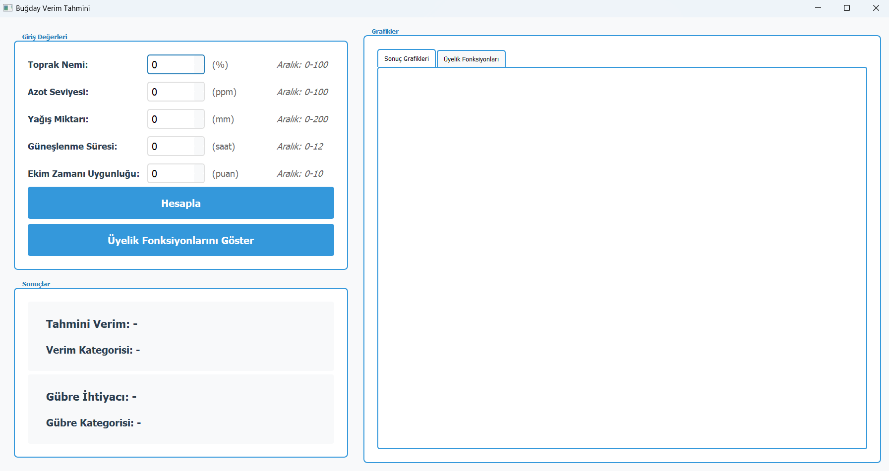
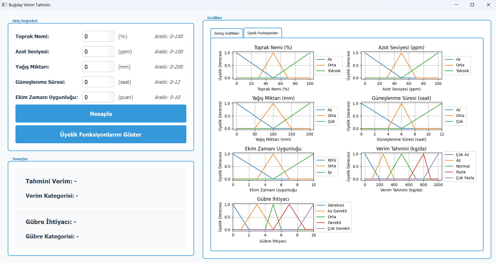
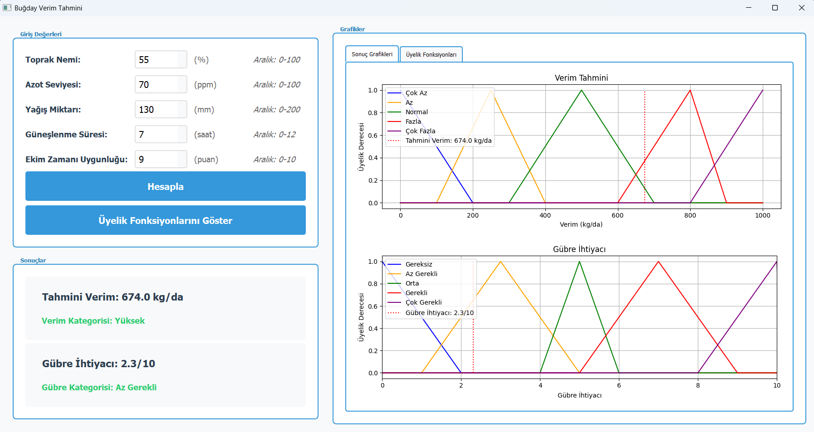
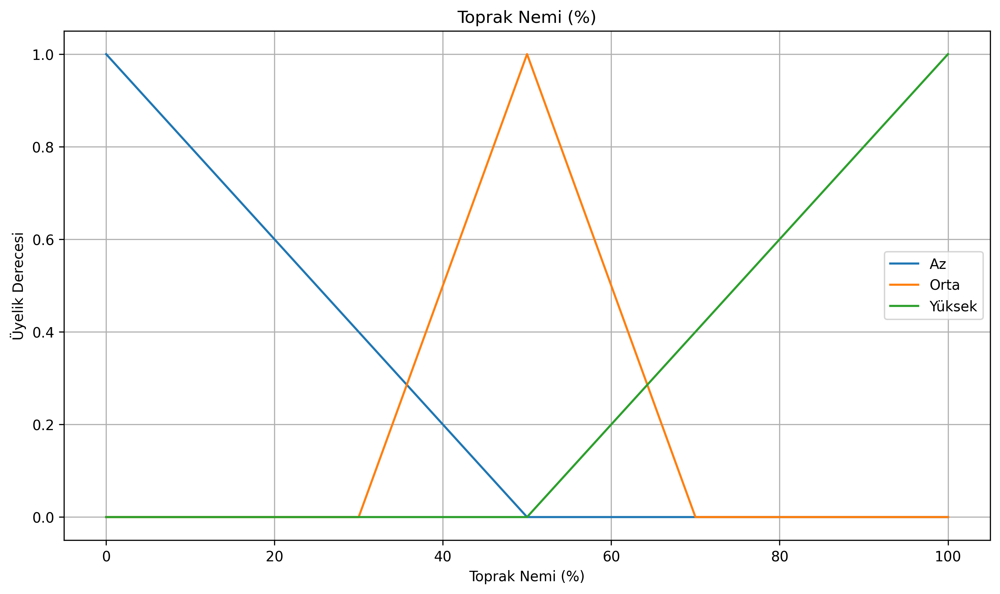
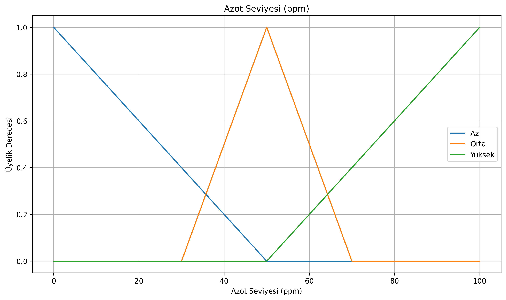
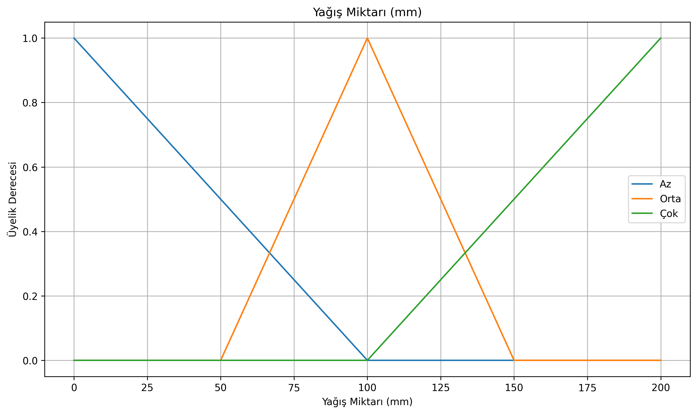
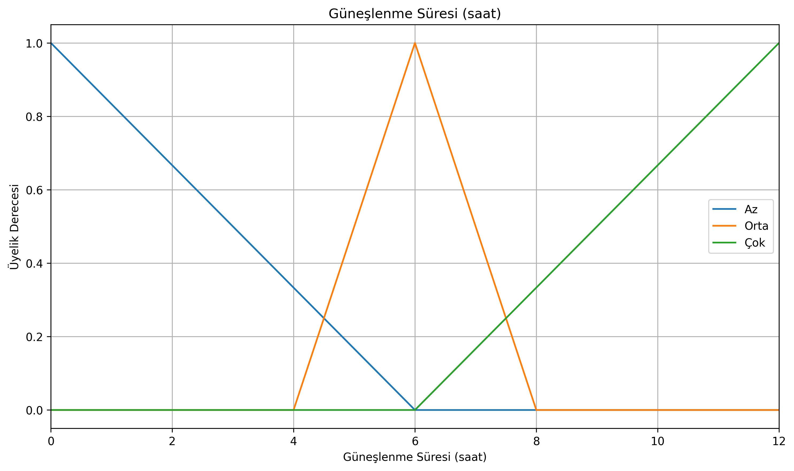
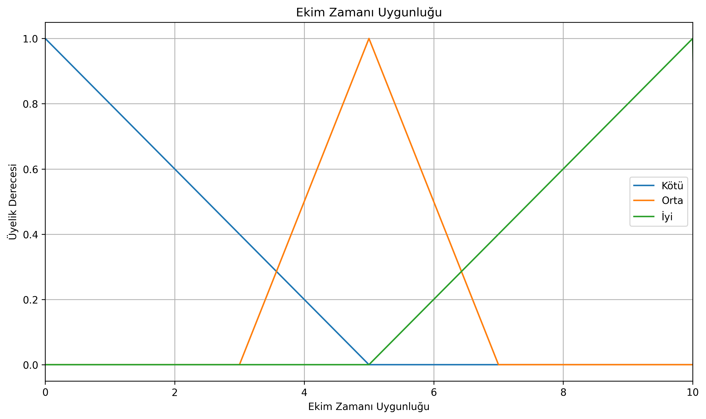
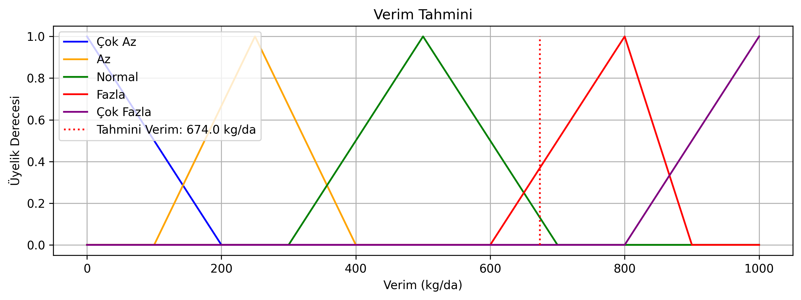
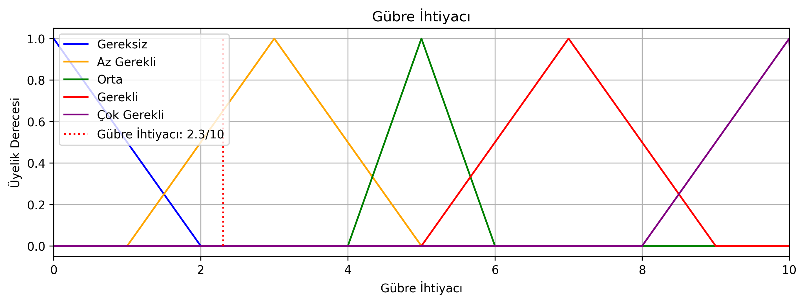

# Buğday Verim Tahmini ve Gübre Önerisi Sistemi

Bu proje, buğday tarımında verim tahmini ve gübre ihtiyacını belirlemek için bulanık mantık (fuzzy logic) kullanan bir karar destek sistemidir.

## Proje Görüntüleri

### Ana Ekran

*Programın ilk açılış ekranı*

### Üyelik Fonksiyonları

*Bulanık mantık üyelik fonksiyonları görünümü*

### Sonuç Ekranı

*Örnek bir tahmin sonucu ve grafikleri*

## Özellikler

- 5 farklı girdi parametresi kullanarak hassas tahmin
- Verim tahmini (kg/da cinsinden)
- Gübre ihtiyacı değerlendirmesi ve öneriler
- Kullanıcı dostu arayüz
- Kapsamlı giriş doğrulama
- Detaylı görselleştirmeler ve grafikler

## Kurulum

1. Python 3.6 veya üstü bir sürüm yükleyin
2. Gerekli kütüphaneleri yükleyin:
```bash
pip install -r requirements.txt
```

## Kullanım

Programı çalıştırmak için:
```bash
python main.py
```

## Giriş Parametreleri ve Üyelik Fonksiyonları

### 1. Toprak Nemi (0-100%)
- **Açıklama**: Toprağın nem oranını yüzde olarak belirtir
- **Aralıklar**:
  - Az (0-50%)
  - Orta (30-70%)
  - Yüksek (50-100%)
- **Üyelik Fonksiyonu**:


### 2. Azot Seviyesi (0-100 ppm)
- **Açıklama**: Topraktaki azot miktarı (ppm - parts per million)
- **Aralıklar**:
  - Az (0-50 ppm)
  - Orta (30-70 ppm)
  - Yüksek (50-100 ppm)
- **Üyelik Fonksiyonu**:


### 3. Yağış Miktarı (0-200 mm)
- **Açıklama**: Aylık ortalama yağış miktarı
- **Aralıklar**:
  - Az (0-100 mm)
  - Orta (50-150 mm)
  - Çok (100-200 mm)
- **Üyelik Fonksiyonu**:


### 4. Güneşlenme Süresi (0-12 saat)
- **Açıklama**: Günlük ortalama güneşlenme süresi
- **Aralıklar**:
  - Az (0-6 saat)
  - Orta (4-8 saat)
  - Çok (6-12 saat)
- **Üyelik Fonksiyonu**:


### 5. Ekim Zamanı Uygunluğu (0-10)
- **Açıklama**: Ekim zamanının uygunluğunu gösteren skor
- **Aralıklar**:
  - Kötü (0-5)
  - Orta (3-7)
  - İyi (5-10)
- **Üyelik Fonksiyonu**:


## Bulanık Mantık Kuralları

Sistem aşağıdaki bulanık mantık kurallarını kullanarak verim tahmini ve gübre ihtiyacını belirler:

### Verim Tahmin Kuralları

#### Temel Nem-Azot İlişkisi
- Eğer nem AZ ve azot AZ ise, verim ÇOK AZ
- Eğer nem AZ ve azot ORTA ise, verim AZ
- Eğer nem AZ ve azot YÜKSEK ise, verim NORMAL
- Eğer nem ORTA ve azot AZ ise, verim AZ
- Eğer nem ORTA ve azot ORTA ise, verim NORMAL
- Eğer nem ORTA ve azot YÜKSEK ise, verim FAZLA
- Eğer nem YÜKSEK ve azot AZ ise, verim NORMAL
- Eğer nem YÜKSEK ve azot ORTA ise, verim FAZLA
- Eğer nem YÜKSEK ve azot YÜKSEK ise, verim ÇOK FAZLA

#### Yağış Etkileri
- Eğer yağış AZ ve nem AZ ise, verim ÇOK AZ
- Eğer yağış ORTA ve nem ORTA ise, verim NORMAL
- Eğer yağış ÇOK ve nem YÜKSEK ise, verim FAZLA

#### Güneşlenme Etkileri
- Eğer güneş AZ ve nem YÜKSEK ise, verim NORMAL
- Eğer güneş ORTA ve nem ORTA ise, verim NORMAL
- Eğer güneş ÇOK ve nem AZ ise, verim AZ

#### Ekim Zamanı Etkileri
- Eğer ekim zamanı KÖTÜ ise, verim AZ
- Eğer ekim zamanı ORTA ise, verim NORMAL
- Eğer ekim zamanı İYİ ise, verim FAZLA

#### İdeal Koşullar
- Eğer nem ORTA ve azot YÜKSEK ve yağış ORTA ve güneş ORTA ve ekim zamanı İYİ ise, verim ÇOK FAZLA

### Gübre İhtiyacı Kuralları

#### Azot Seviyesine Göre
- Eğer azot AZ ise, gübre ÇOK GEREKLİ
- Eğer azot ORTA ve verim ÇOK AZ ise, gübre ÇOK GEREKLİ
- Eğer azot ORTA ve verim AZ ise, gübre GEREKLİ
- Eğer azot ORTA ve verim NORMAL ise, gübre ORTA
- Eğer azot ORTA ve verim FAZLA/ÇOK FAZLA ise, gübre AZ GEREKLİ
- Eğer azot YÜKSEK ve verim ÇOK AZ/AZ ise, gübre GEREKLİ
- Eğer azot YÜKSEK ve verim NORMAL ise, gübre AZ GEREKLİ
- Eğer azot YÜKSEK ve verim FAZLA/ÇOK FAZLA ise, gübre GEREKSİZ

#### Nem ve Yağış Durumuna Göre
- Eğer nem YÜKSEK ve yağış ÇOK ise, gübre GEREKSİZ
- Eğer nem AZ ve yağış AZ ise, gübre ÇOK GEREKLİ

#### Nem-Azot Kombinasyonları
- Eğer nem ORTA ve azot AZ ise, gübre GEREKLİ
- Eğer nem ORTA ve azot ORTA ise, gübre ORTA
- Eğer nem ORTA ve azot YÜKSEK ise, gübre AZ GEREKLİ
- Eğer nem YÜKSEK ve azot AZ ise, gübre GEREKLİ
- Eğer nem YÜKSEK ve azot ORTA ise, gübre AZ GEREKLİ
- Eğer nem YÜKSEK ve azot YÜKSEK ise, gübre GEREKSİZ

## Çıktılar ve Sonuç Grafikleri

### 1. Verim Tahmini (kg/da)
- **Aralıklar**:
  - Çok Az (0-200 kg/da)
  - Az (200-400 kg/da)
  - Normal (400-600 kg/da)
  - Fazla (600-800 kg/da)
  - Çok Fazla (800-1000 kg/da)
- **Sonuç Grafiği**:


### 2. Gübre İhtiyacı (0-10)
- **Aralıklar**:
  - Gereksiz (0-2)
  - Az Gerekli (2-4)
  - Orta Düzeyde Gerekli (4-6)
  - Gerekli (6-8)
  - Çok Gerekli (8-10)
- **Sonuç Grafiği**:


## Örnek Sonuçlar ve Yorumlar

### Verim Tahminleri
- **Çok Düşük** (<200 kg/da): Acil iyileştirme gerekli
- **Düşük** (200-400 kg/da): Verim artırıcı önlemler alınmalı
- **Normal** (400-600 kg/da): Kabul edilebilir verim
- **Yüksek** (600-800 kg/da): İyi verim
- **Çok Yüksek** (>800 kg/da): Mükemmel verim

### Gübre Önerileri
- **Gereksiz** (0-2): Toprak yeterince zengin, gübreleme gerekmiyor
- **Az Gerekli** (2-4): Minimum düzeyde gübreleme yeterli
- **Orta** (4-6): Standart gübreleme önerilir
- **Gerekli** (6-8): Yoğun gübreleme programı uygulanmalı
- **Çok Gerekli** (8-10): Acil ve yoğun gübreleme gerekli

## Lisans

Bu proje MIT lisansı altında lisanslanmıştır. Detaylar için [LICENSE](LICENSE) dosyasına bakınız. 
